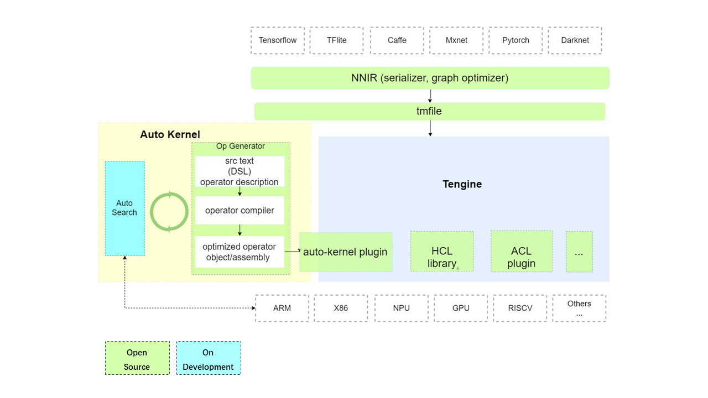

# Architecture  
  
  

AutoKernel consists of three modules：    
* Operator generator: 

  This module uses the open source project [Halide](https://github.com/halide/Halide). Halide is an automatic code generation project widely used in the industry, and it is the first to propose the separation of calculation and scheduling. The input of this module is the calculation description of the operator that has nothing to do with the hardware, and the output is the optimized assembly code/object file of the corresponding back-end；     

* Auto Search：
  
  This module can search for the scheduling strategy parameters of the optimal operator of the corresponding back-end through optimization algorithm/search algorithm/machine learning/reinforcement learning (this module is still under development)；      
* AutoKernel Plugin：   
  
 [Tengine](https://github.com/OAID/Tengine) is OPEN AILAB's open source deep learning inference framework, which realizes the rapid and efficient deployment of AI algorithms on different hardware. This module realizes the one-click integration of the automatically generated optimization operator code into [Tengine](https://github.com/OAID/Tengine) in the form of a plugin to realize the one-click deployment of the automatic optimization operator;
