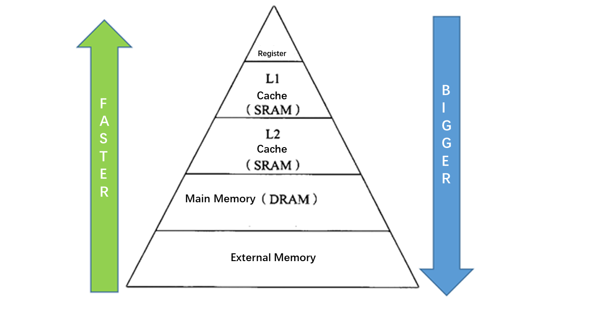

# Halide Schedule 
The schedule is the other integral part of a Halide program; it specifies how the algorithm computation is to be structured. This schedule entails specifying the storage allocation and computation of the stages of the pipeline in relation with each other. It also entails specifying how each stage is to be computed.

This section will explain the following schedules. In addition to giving pseudo-code in C language, each schedule explains in more depth why this schedule can be optimized and understands the optimization nature of schedule.    

The code for this section is：[data/05_loop_schedule.py](data/05_loop_schedule.py)。

  - reorder
  - split
  - fuse
  - tile
  - vectorize
  - unroll
  - parallel
  - compute_at
  - compute_root
## Optimize Goal   

1.Improve locality, improve cache hit rate    

    The following figure shows a typical memory hierarchy. The main memory is a relatively large storage space, but the speed is slow. The cache speed is much faster, but the capacity is small. Therefore, the optimization strategy is to improve the locality, make the data in the cache as much as possible, and improve the cache hit rate.     

2.Improve parallelism: instruction set parallelism, data-level parallelism, task-level parallelism   




## Halide Debug interface
Halide's function provides an interface for debugging print cycle scheduling strategy：
```
func.print_loop_nest()
```
Take a simple function as an example to view the traversal order of the loop    
```python
def origin():
    x, y = hl.Var("x"), hl.Var("y")
    w,h = 8,8
    func = hl.Func("func_origin")
    func[x,y] = x + 10*y
    out = func.realize(w, h)
    func.print_loop_nest()
```
Execution result：
```
    produce func_origin:
    for y:
      for x:
        func_origin(...) = ...
```

---------------------

Let's start with a detailed explanation of each scheduling strategy.    

## fuse 
```cpp
# Before Fusing
min = a[0];
for (i=0; i<n; i++)
    if (a[i]<min)
       min = a[i];
max = a[0];
for (i=0; i<n; i++)
    if (a[i]>max)
       max = a[i];

# After Fusing
min = a[0];
max = a[0];
for (i=0; i<n; i++){
    if (a[i]<min)
       min = a[i];
    if (a[i]>max)
       max = a[i];
}

```
The essence of fuse operation is to multiplex two independent cycles of data. Every time data is obtained from the main memory, the CPU loads the data and its neighboring data into the cache to facilitate the locality of reference. If the loop size N is large enough, two independent loops accessing the data may cause a cache miss when the second loop accesses the data. The advantage of merging the two loops is to reduce the occurrence of cache misses.     

The following calls Halide's fuse:
```
def fuse():
    func = hl.Func("func_fuse")
    func[x,y] = x + 10*y

    xy_fuse = hl.Var("xy_fuse")
    func.fuse(x,y,xy_fuse)
    out = func.realize(w, h)
    func.print_loop_nest()
'''
Execution result：
```
    produce func_fuse:
      for x.xy_fuse:
        func_fuse(...) = ...
'''
## Unroll   
```cpp
# Before Unrolling
for(i=0; i<n; i++)
    a[i] = 2 * b[i] + 1;

# After Unrolling（factor=8)
for(i=0; i<n; i+=8){
    a[i] = 2 * b[i] + 1;
    a[i+1] = 2 * b[i+1] + 1;
    a[i+2] = 2 * b[i+2] + 1;
    a[i+3] = 2 * b[i+3] + 1;
    a[i+4] = 2 * b[i+4] + 1;
    a[i+5] = 2 * b[i+5] + 1;
    a[i+6] = 2 * b[i+6] + 1;
    a[i+7] = 2 * b[i+7] + 1;
}
```
The purpose of loop unrolling is to make full use of registers and reduce the number of times that the memory is loaded and saved for each operation during the loop. Improve the utilization of registers and make full use of registers to cache data, which can greatly reduce the latency of accessing memory, thereby effectively improving memory bandwidth.   

The unrolling loop has a parameter (unroll factor). The setting strategy of this parameter is to match the cache line size of the hardware according to the data type. For example, if the cache line is 64 bytes, it is not appropriate to set the unroll factor to 9 or 10. The general data type is 4byte or 8byte, then it is more appropriate to set this parameter to 8 or 16, because it just happens to unroll the memory once. The read size is about the size of a cache line.   

Then call the unroll of Halide:     
```
def unroll():
    func = hl.Func("func_unroll")
    func[x,y] = x + 10*y

    factor = 2
    func.unroll(x,factor)
    out = func.realize(w, h)
    func.print_loop_nest()
```
Execution result：
```
    produce func_unroll:
    for y:
      for x.x:
        unrolled x.v1 in [0, 1]:
          func_unroll(...) = ...
```
## Vectorize    
```
# Before vectorizing   
for(i=0;i<100;i++)
    a[i]= b[i] + 1

# After vectorizing   
for(i=0;i<100;i+=4)
    a[i:i+4]= b[i:i+4] + 1
```
Vectorization is to convert several scalar calculations (scale) into a vector calculation (vector), making full use of SIMD vector instructions. Most modern CPUs support SIMD (Single Instruction Multiple Data). In the same CPU cycle, SIMD can execute the same operation/instruction (such as addition, multiplication, etc.) on multiple values at the same time. If we run SIMD instructions on 4 data points at the same time, it will directly achieve a 4x speedup.    

The following calls Halide's vectorize:
```
def vectorize():
    func = hl.Func("func_vectorize")
    func[x,y] = x + 10*y

    factor = 4
    func.vectorize(x,factor)
    out = func.realize(w, h)
    func.print_loop_nest()
```
Execution result：
```
    produce func_vectorize:
    for y:
      for x.x:
        vectorized x.v0 in [0, 3]:
          func_vectorize(...) = ...
```
## reorder 
```cpp
# reorder之前
for(j=0; j<m; j++)
    for(i=0; i<n; i++)
        a[i][j] = b[i][j] + c[i][j];

# reoder之后
for(i=0; i<n; i++)
    for(j=0; j<m; j++)
        a[i][j] = b[i][j] + c[i][j];
```
The reorder operation is to exchange the order of two nested loops to make the innermost memory access friendly. For example, the data of a two-dimensional matrix is stored in row-major order (row-major order is the storage order). After the reorder adjusts the loop sequence, the data access of the matrix can be made row-by-row. Such access is consistent with cache prefetching, which improves the locality of the data.    

The following calls Halide's reoder:    
```
def reorder():
    func = hl.Func("func_reorder")
    func[x,y] = x + 10*y
    func.reorder(y,x)
    out = func.realize(w, h)
    func.print_loop_nest()
```
Execution result：  
```
    produce func_reorder:
    for x:
      for y:
        func_reorder(...) = ...
    '''
```
## parallize
```
# Before Parallizing
for(i=0;i<100;i++)
    a[i]= sin(PI*i/100)

# After Parallizing
Thread 1: 0, 2, 3, ..., 24
        for(i=0;i<25;i++)
            a[i]= sin(PI*i/100)

Thread 2: 25,26,27, ...,49
        for(i=25;i<50;i++)
            a[i]= sin(PI*i/100)

Thread 3: 50,51,52, ...,74
        for(i=50;i<75;i++)
            a[i]= sin(PI*i/100)

Thread 4: 75,76,77, ...,99
        for(i=75;i<100;i++)
            a[i]= sin(PI*i/100)
```
Parallelizing a loop is to allocate each repetition of the loop to multiple threads or processors for simultaneous processing. Each thread processes through the code segment (loop body), but processes different data.    

## tile    

The purpose of chunking is also to make full use of the cache. If the original loop is large, the tiles are changed to small blocks of data to calculate, so that the data calculated each time can stay in the cache more comfortably, without experiencing repeated evictions (repeat adding and deleting data in the cache, That is, cache thrashing).    

Use Halide's tile to specify the block size, y_factor, x_factor    
```
for y in range(n):
    for x in range(m):
        ...

# Execute tile
for y in range(n//y_factor):
    for x in range(m//x_factor):
        for yi in range(y_factor):
            for xi in range(x_factor):
                ...
```
Below call Halide's tile:
```
def tile():
    func = hl.Func("func_tile")
    func[x,y] = x + 10*y

    xo, xi, yo, yi = hl.Var("xo"), hl.Var("xi"),hl.Var("yo"), hl.Var("yi")
    xfactor, yfactor = 4, 8
    func.tile(x,y,xo,yo,xi,yi,xfactor,yfactor)
    out = func.realize(w, h)
    func.print_loop_nest()
```
Execute result：
```
    produce func_tile:
    for y.yo:
      for x.xo:
        for y.yi in [0, 7]:
          for x.xi in [0, 3]:
            func_tile(...) = ...
```
The next schedules
  - compute_at
  - compute_root
  - update

Please execute the code of [data/05_loop_schedule.py](data/05_loop_schedule.py) by yourself, welcome to submit supplementary documents
